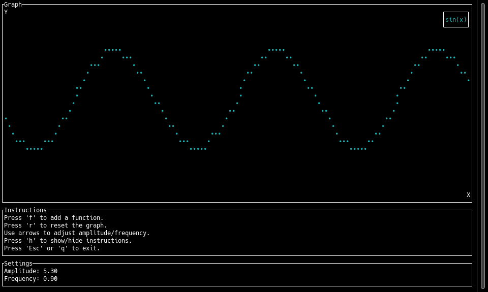

# TUI Plotter



This is a terminal-based interactive plotting program inspired by Desmos, built with Rust and the `ratatui` and `crossterm` libraries. It allows you to plot various mathematical functions, adjust their parameters interactively, and view the results in real-time.

## Features

- Plot trigonometric functions: sine, cosine, tangent, secant, cosecant, cotangent.
- Support for parametric functions.
- Interactive amplitude and frequency adjustments using arrow keys.
- Toggle instructions visibility.
- Menu-driven function selection.
- Reset the graph with a single key press.

## Requirements

- Rust (edition 2021 or later)
- Cargo (Rust's package manager)
- **Debian-based systems**: `libqalculate-dev` package

### Dependencies

- `ratatui` (formerly `tui-rs`): A terminal user interface library.
- `crossterm`: A cross-platform terminal manipulation library.
- `plotters`: A plotting library for Rust.
- `braille-rs`: A library for rendering braille in the terminal.
- `cc`: A build tool for C/C++ code.
- `libqalculate-dev`: A development library for `libqalculate`.

## Installation

### 1. Install Rust and Cargo

If you don't have Rust installed, you can install it using `rustup`:

```bash
curl --proto '=https' --tlsv1.2 -sSf https://sh.rustup.rs | sh
```

After installing Rust, ensure `cargo` is available in your PATH.

### 2. Install `libqalculate-dev`

For Debian-based systems (e.g., Ubuntu), you can install `libqalculate-dev` using `apt`:

```bash
sudo apt-get update
sudo apt-get install libqalculate-dev
```

### 3. Clone the Repository

```bash
git clone https://github.com/yourusername/tui-plotter.git
cd tui-plotter
```

### 4. Install Dependencies and Build the Project

The `Cargo.toml` file contains all the necessary dependencies. Simply run:

```bash
cargo build --release
```

### 5. Run the Program

After the project has been successfully built, you can run it with:

```bash
cargo run --release
```

## Usage

- **f**: Open the function selection menu.
- **Arrow Keys**: Navigate the menu or adjust amplitude and frequency.
- **Enter**: Select a function from the menu.
- **r**: Reset the graph.
- **h**: Show/hide instructions.
- **Esc/q**: Exit the program.

## Example

Once the program is running, you can add functions by pressing `f`, navigating the menu with the arrow keys, and pressing `Enter` to select a function. You can adjust the amplitude and frequency of the plotted functions using the arrow keys and reset the graph with `r`.

## Troubleshooting

If you encounter any issues while building or running the program, make sure all dependencies are up-to-date by running:

```bash
cargo update
```

If you still experience issues, please check that you have the required Rust version installed (`rustc --version`).

## Contributing

Feel free to fork this repository and make improvements. Pull requests are welcome!

## License

This project is licensed under the GNU General Public License v3.0. See the [LICENSE](LICENSE) file for more details.

For the full text of the GNU General Public License, please see <https://www.gnu.org/licenses/>.
